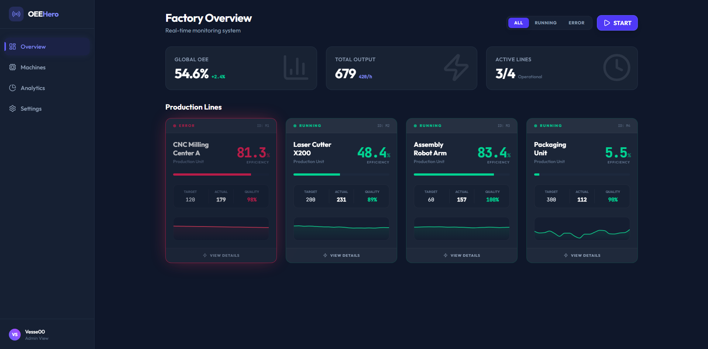

# 🏭 Industrial OEE Dashboard


> **Live Demo:** 

A modern, real-time industrial monitoring system built to visualize **Overall Equipment Effectiveness (OEE)** metrics. This project simulates a high-frequency production environment with live data updates, stochastic failure generation, and interactive analytics.



## 🚀 Key Features

* **Real-Time Simulation Engine:** Custom-built stochastic generator (Random Walk algorithm) that mimics realistic machine behavior, including inertia, micro-stops, and critical failures.
* **Live OEE Calculation:** Automatic computation of Availability × Performance × Quality metrics in real-time.
* **Reactive UI:**
    * **Glassmorphism & Neon Design:** Aesthetic "Dark Hero" interface inspired by modern SaaS industrial tools.
    * **Smart Filtering:** Instantly filter machines by status (Running/Error) with animated transitions.
    * **Data Visualization:** Sparkline charts rendering live trends using `Recharts`.
* **Performance:** Optimized rendering using `Zustand` for state management and `Framer Motion` for layout animations without layout thrashing.

## 🛠️ Tech Stack

This project was built with a focus on **performance**, **type safety**, and **modern aesthetics**.

| Category | Technology | Usage |
| :--- | :--- | :--- |
| **Core** |   | Component architecture & blazing fast bundling. |
| **Language** |  | Fully typed interfaces for robust data handling. |
| **Styling** |  | Utility-first styling with custom animations and glassmorphism. |
| **State** | **Zustand** | Lightweight, transient-update state management for high-frequency data. |
| **Charts** | **Recharts** | Composable charting library for React. |
| **Motion** | **Framer Motion** | Complex layout animations and micro-interactions. |

## 🧩 Architecture Highlights

### The Simulation Engine (`useStore.ts`)
Instead of a simple `Math.random()`, the simulator uses a **drifting algorithm** to ensure data continuity.
1.  **Inertia:** Values don't jump from 0 to 100; they "drift" naturally based on previous states.
2.  **Chaos Monkey:** A probabilistic model randomly triggers "warnings" and "critical errors" to test the UI's response to alert states.
3.  **Self-Healing:** Machines have a probability to auto-recover, simulating operator intervention.

### Component Structure
* **`Layout`**: Handles the responsive Sidebar and global "Hero" background effects.
* **`MachineCard`**: A stateless presentation component that visualizes complex data sets (Sparklines, Progress Bars) with dynamic "Glow" effects based on machine status.

## 📦 Getting Started

1.  **Clone the repository:**
    ```bash
    git clone [https://github.com/your-username/oee-dashboard.git](https://github.com/your-username/oee-dashboard.git)
    ```
2.  **Install dependencies:**
    ```bash
    npm install
    ```
3.  **Run development server:**
    ```bash
    npm run dev
    ```

## 🎨 Design Philosophy

The goal was to move away from "boring corporate dashboards" and create an interface that feels **precise, futuristic, and engaging**.
* **Color Palette:** Deep Slate background (`#0f172a`) with semantic neons: Emerald (Running), Rose (Error), Amber (Warning).
* **Visual Hierarchy:** Critical data (OEE %) is prioritized. Sparklines provide context without clutter.

---
*Created by Maciej Szczypta - 2026*
